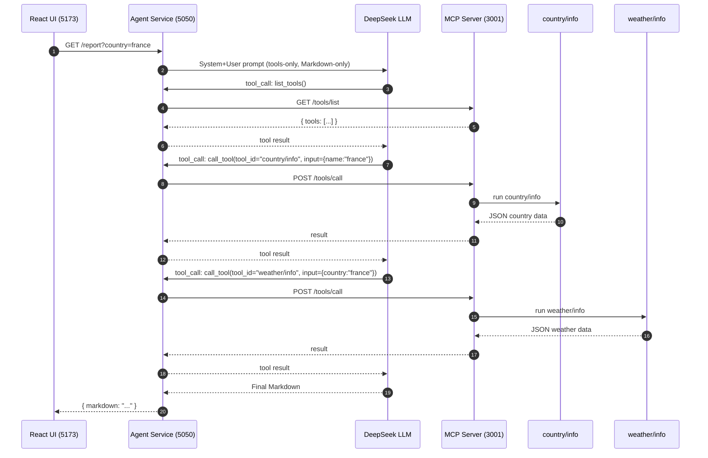

# 🧠 Agentic AI Demo: MCP Tools + DeepSeek + React (Dockerized)

This project demonstrates a **full agentic AI setup** running via Docker Compose:

- **MCP Server (Flask)** → hosts multiple tools (e.g. `country/info`, `weather/info`)
- **DeepSeek Agent Service (Flask + DeepSeek LLM)** → orchestrates tool calls using LLM function-calling and generates structured Markdown reports
- **React Frontend (Vite + React + ReactMarkdown)** → calls the agent service and renders the Markdown with live preview

---

## 📊 Architecture

```mermaid
flowchart LR
  subgraph FE[React App (Vite, http://localhost:5173)]
    UI[Country input + Generate]
    MD[Markdown Preview (react-markdown)]
  end

  subgraph AG[DeepSeek Agent Service (Flask, http://localhost:5050)]
    DSP[DeepSeek LLM\n(OpenAI-compatible)]
    LOOP[Function-calling loop:\nlist_tools(), call_tool()]
    API[/GET/POST /report\nGET /health/]
  end

  subgraph MCP[MCP Server (Flask, http://localhost:3001)]
    ROUTES[/GET /tools/list\nPOST /tools/call\nGET /health/]
    T1[[country/info\n@ mcp.tool]]
    T2[[weather/info\n@ mcp.tool]]
  end

  UI -->|GET /report?country=france| API
  API --> DSP
  DSP -->|tool_call| LOOP
  LOOP -->|HTTP| ROUTES
  ROUTES --> T1
  ROUTES --> T2
  T1 -->|JSON| ROUTES
  T2 -->|JSON| ROUTES
  ROUTES --> LOOP
  LOOP --> DSP
  DSP -->|Markdown| API
  API -->|{ markdown }| UI
  UI --> MD
```

---

## 🔄 Sequence Diagram



---

## ⚙️ Services

### 🔹 MCP Server
- Port: **3001**
- Endpoints: `/health`, `/tools/list`, `/tools/call`
- Tools auto-discovered from `tools/` folder
- Example tools:
  - `country/info` → RestCountries API
  - `weather/info` → Open-Meteo geocoding

### 🔹 DeepSeek Agent Service
- Port: **5050**
- Wraps DeepSeek LLM with a tool-using loop
- Endpoints:
  - `/health`
  - `/report?country=france` (GET or POST)
- System prompt ensures output is **Markdown only** from MCP tool results

### 🔹 React Frontend
- Port: **5173**
- Provides input box for country name and renders generated Markdown

---

## 🐳 Docker Compose Setup

### Prereqs
- Docker + Docker Compose
- DeepSeek API key

### Run
```bash
cd agentic-stack

# Set your DeepSeek key
export DEEPSEEK_API_KEY=sk-xxxx
# PowerShell:
# $env:DEEPSEEK_API_KEY="sk-xxxx"

docker compose up --build
```

### Access
- React UI → http://localhost:5173
- Agent health → http://localhost:5050/health
- MCP health → http://localhost:3001/health

Type a country (e.g. `france`) in the UI and click **Generate Report**.

---

## 🔑 Environment Variables

### MCP Server
- `MCP_API_KEY` (default `dev-key-123`)
- `PORT` (default `3001`)
- `HOST` (default `0.0.0.0`)

### DeepSeek Agent Service
- `DEEPSEEK_API_KEY` → your DeepSeek key
- `DEEPSEEK_BASE_URL` (default `https://api.deepseek.com`)
- `DEEPSEEK_MODEL` (default `deepseek-chat`)
- `MCP_BASE_URL` (default `http://mcp-server:3001`)
- `MCP_API_KEY` (default `dev-key-123`)
- `SERVICE_PORT` (default `5050`)

### React Frontend
- `VITE_AGENT_BASE_URL` (default `http://localhost:5050`)

---

## 🧠 Why This Is Agentic AI

- The **LLM (DeepSeek)** decides which MCP tools to call and in what order
- The **Agent Service** executes those tool calls and returns the results to the LLM
- The LLM is constrained to use only tool outputs and format them into a **Markdown report**
- The React app renders this structured report, ensuring **no hallucination leaks**

This implements the loop: **Reason → Act (via tools) → Observe → Report**.

---

## ✅ Next Steps

- Add more MCP tools (finance, HR, etc.)
- Add memory (vector DB)
- Add Docker volumes for persistent data
- CI/CD pipeline for builds
